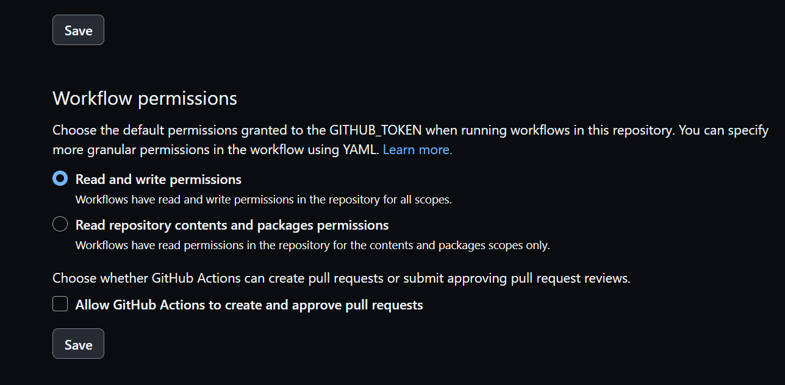

## DVC NLP project 
In this NLP (Natural Language Processing) project, I address the challenge of classifying Stack Overflow comments as belonging to the 'Python' programming language or not. This project revolves around a binary classification task, where I leverage the power of NLP and machine learning techniques to make informed decisions

#### Key Tools and Technologies:

1. Python
2. NLP (Natural Language Processing)
3. AWS (Amazon Web Services)
4. Continuous Integration (CI) and Continuous Deployment (CD)
5. GitHub Actions
6. AWS S3
7. AWS EC2
8. DVC (Data Version Control)
9. DVC Studio
10. Data Pipeline Management

Through the synergy of Python programming, NLP methodologies, AWS cloud capabilities, and modern CI/CD practices, I explore the dynamic world of NLP-based binary classification

## Reference Repository:

1. [Official reference repo](https://github.com/iterative/example-get-started)
2. [DVC Studio](https://studio.iterative.ai/)
3. [My DVC Studio View](https://studio.iterative.ai/user/shivpalSW/projects/DVC-NLP-Simple-usecase-2athy60zhk)

### STEP 01- Create a repository by using template repository

### STEP 02- Clone the new repository

### STEP 03- Create a conda environment after opening the repository in VSCODE

```bash
conda create --prefix ./env python=3.7 -y
```

```bash
conda activate ./env
```
OR
```bash
source activate ./env
```

### STEP 04- install the requirements
```bash
pip install -r requirements.txt
```

### STEP 05- initialize the dvc project
```bash
dvc init
```

### STEP 06- commit and push the changes to the remote repository

#### Note: If error message indicates that the GitHub integration used for CML is not able to access the resource needed to create a comment. This can happen due to various reasons, but one common cause is insufficient permissions for the GitHub token used in the integration.Then you must Verify that the GitHub Actions bot (typically named "github-actions") has sufficient access to the repository. It should have at least "Write" access to create comments.

